# 🏥 Medical Dashboard System Flowchart

## System Architecture & User Flow

```mermaid
graph TD
    A[👤 User Visits Application] --> B{Authentication Check}
    B -->|Not Authenticated| C[🔐 Login Page]
    B -->|Authenticated| D[📋 Role-Based Dashboard]
    
    C --> E{Login Credentials}
    E -->|Doctor Login| F[👨‍⚕️ Doctor Dashboard]
    E -->|Patient Login| G[👤 Patient Dashboard]
    E -->|Staff Login| H[👥 Staff Dashboard]
    E -->|Invalid| C
    
    D --> F
    D --> G
    D --> H
    
    %% Doctor Dashboard Flow
    F --> I[🔍 Patient Search]
    F --> J[📊 Practice Overview]
    F --> K[📅 Schedule Management]
    F --> L[📄 Report Generation]
    
    I --> M{Search Type}
    M -->|ID Search| N[🆔 Search by Patient ID]
    M -->|Show All| O[📋 Load All Patients]
    
    N --> P{Patient Found?}
    P -->|Yes| Q[👤 Display Patient Details]
    P -->|No| R[❌ No Patient Found]
    
    O --> S[📑 Patient List Display]
    S --> T[👆 Click Patient Card]
    T --> Q
    
    Q --> U[📈 Load Medical Timeline]
    Q --> V[📝 Patient History Tabs]
    Q --> W[💊 Diet & Notes Management]
    
    V --> X[📅 History Tab]
    V --> Y[📄 Notes Tab]
    V --> Z[🍎 Diet Tab]
    
    X --> AA[⏰ Appointment Timeline]
    Y --> BB[➕ Add New Notes]
    Z --> CC[🥗 Prescribe Diet Plan]
    
    AA --> DD[📋 Appointment Details]
    BB --> EE[💾 Save Patient Notes]
    CC --> FF[💾 Save Diet Prescription]
    
    %% Schedule & Reports
    K --> GG[📅 Today's Appointments]
    K --> HH[➕ New Appointment Creation]
    
    L --> II[📄 Generate PDF Report]
    II --> JJ[📊 Patient Summary]
    II --> KK[📈 Medical Timeline]
    II --> LL[💾 Download PDF]
    
    %% Practice Overview
    J --> MM[📊 Patient Statistics]
    J --> NN[✅ Completed Sessions]
    J --> OO[⚠️ Pending Reviews]
    J --> PP[👥 Total Patients]
    
    MM --> QQ[📈 Progress Rings]
    NN --> RR[🎯 Session Tracking]
    OO --> SS[⚡ Urgent Actions]
    PP --> TT[📊 Growth Analytics]
```

## Data Flow Architecture

```mermaid
graph LR
    A[🎯 Frontend React App] --> B[🔧 TypeScript Interfaces]
    B --> C[📊 Mock Data Service]
    C --> D[🗄️ Local Storage]
    C --> E[🔥 Firebase Backend]
    
    E --> F[👤 User Authentication]
    E --> G[📋 Patient Records]
    E --> H[📅 Appointment Data]
    E --> I[📄 Medical Notes]
    
    A --> J[🎨 UI Components]
    J --> K[📱 shadcn/ui Library]
    J --> L[🎭 Tailwind CSS]
    J --> M[✨ Lucide Icons]
    
    A --> N[📄 PDF Generation]
    N --> O[📚 jsPDF Library]
    O --> P[📥 Download Reports]
    
    A --> Q[🖼️ Media Assets]
    Q --> R[🎥 Background Videos]
    Q --> S[🖼️ Patient Photos]
    Q --> T[🎨 Background Images]
```

## Component Hierarchy

```mermaid
graph TD
    A[🏠 App.tsx] --> B[📄 Index.tsx - Landing Page]
    A --> C[👨‍⚕️ DoctorDashboard.tsx]
    A --> D[👤 PatientDashboard.tsx]
    A --> E[🔐 LoginForm.tsx]
    
    B --> F[🎥 Video Background]
    B --> G[🏥 Feature Cards]
    B --> H[📊 Statistics Section]
    B --> I[🚀 CTA Buttons]
    
    C --> J[🔍 Patient Search Card]
    C --> K[📋 Patient List Card]
    C --> L[👤 Patient Details Card]
    C --> M[📊 Practice Overview Card]
    C --> N[📅 Schedule Card]
    C --> O[⚡ Quick Actions Card]
    
    J --> P[🔍 Search Input]
    J --> Q[🔘 Search Button]
    J --> R[👥 Show All Button]
    
    K --> S[👤 Patient Cards]
    S --> T[🖼️ Patient Photo]
    S --> U[📝 Patient Info]
    S --> V[🏷️ Status Badges]
    
    L --> W[📊 Patient Hero Section]
    L --> X[📑 Tabs Container]
    X --> Y[📅 History Tab]
    X --> Z[📄 Notes Tab]
    X --> AA[🍎 Diet Tab]
    
    Y --> BB[⏰ Timeline Component]
    BB --> CC[📋 Appointment Cards]
    
    M --> DD[📊 Stats Cards]
    DD --> EE[👥 Today's Patients]
    DD --> FF[✅ Completed Sessions]
    DD --> GG[⚠️ Pending Reviews]
    DD --> HH[📈 Total Patients]
```

## User Interaction Flow

```mermaid
sequenceDiagram
    participant U as 👤 User
    participant A as 🏠 App
    participant L as 🔐 Login
    participant D as 👨‍⚕️ Dashboard
    participant S as 🔍 Search
    participant P as 📄 PDF
    
    U->>A: Visit Application
    A->>L: Check Authentication
    L->>U: Show Login Form
    U->>L: Enter Credentials
    L->>D: Redirect to Dashboard
    
    U->>D: View Practice Overview
    D->>U: Show Statistics & Charts
    
    U->>S: Search Patient
    S->>D: Display Patient List
    U->>D: Select Patient
    D->>U: Show Patient Details
    
    U->>D: View Medical Timeline
    D->>U: Display Appointment History
    
    U->>D: Add Notes/Diet Plan
    D->>U: Save & Confirm
    
    U->>P: Generate Report
    P->>U: Download PDF
    
    U->>D: Create New Appointment
    D->>U: Show Appointment Form
    U->>D: Save Appointment
    D->>U: Update Schedule
```

## State Management Flow

## Technology Stack Integration

```mermaid
graph TB
    subgraph "Frontend Layer"
        A[⚛️ React 18]
        B[📘 TypeScript]
        C[⚡ Vite]
        D[🎨 Tailwind CSS]
    end
    
    subgraph "UI Components"
        E[🔧 shadcn/ui]
        F[📱 Radix UI]
        G[✨ Lucide Icons]
        H[🎭 CSS Animations]
    end
    
    subgraph "Data Layer"
        I[🔥 Firebase]
        J[🗄️ Local Storage]
        K[📊 Mock Data]
        L[🔗 API Services]
    end
    
    subgraph "Features"
        M[📄 PDF Generation]
        N[🔍 Search System]
        O[📅 Scheduling]
        P[📊 Analytics]
    end
    
    A --> E
    B --> A
    C --> A
    D --> E
    
    E --> F
    F --> G
    G --> H
    
    A --> I
    I --> J
    J --> K
    K --> L
    
    A --> M
    A --> N
    A --> O
    A --> P
    
    M --> Q[📚 jsPDF]
    N --> R[🔍 Filter Logic]
    O --> S[📅 Calendar Utils]
    P --> T[📊 Chart Libraries]
```

## Key Features & Workflows

### 🔍 **Patient Search System**
1. **ID-based Search**: Direct patient lookup by unique ID
2. **List All Patients**: Display complete patient database
3. **Real-time Filtering**: Instant search results
4. **Patient Selection**: Click to view detailed information

### 👤 **Patient Management**
1. **Profile Display**: Photo, demographics, medical info
2. **Timeline View**: Chronological appointment history
3. **Notes System**: Add/edit medical observations
4. **Diet Prescriptions**: Nutritional recommendations

### 📊 **Practice Analytics**
1. **Today's Statistics**: Current patient count and progress
2. **Completion Tracking**: Session progress indicators
3. **Pending Alerts**: Overdue reviews and urgent items
4. **Growth Metrics**: Patient base expansion tracking

### 📄 **Report Generation**
1. **PDF Creation**: Professional medical reports
2. **Patient Summary**: Comprehensive patient information
3. **Timeline Export**: Medical history documentation
4. **Download System**: Save reports locally

### 🎨 **UI/UX Features**
1. **Glass Morphism**: Modern backdrop-blur effects
2. **Dark Theme**: High-opacity dark design system
3. **Responsive Design**: Mobile-first approach
4. **Micro-interactions**: Smooth animations and transitions

---

*This flowchart represents the complete system architecture and user workflows for the Medical Dashboard Application built with React, TypeScript, and modern web technologies.*
